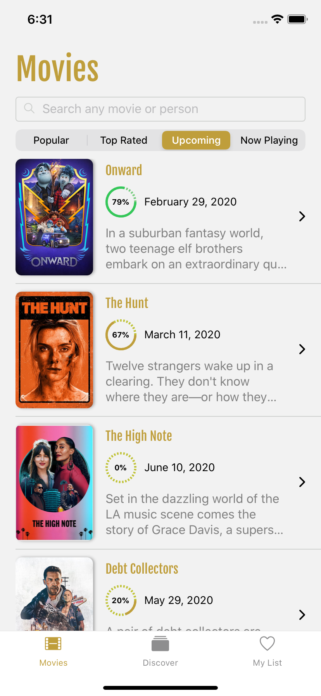
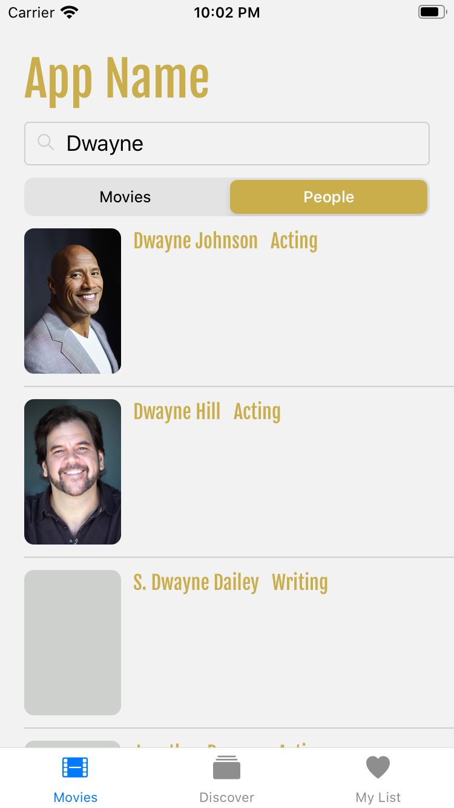
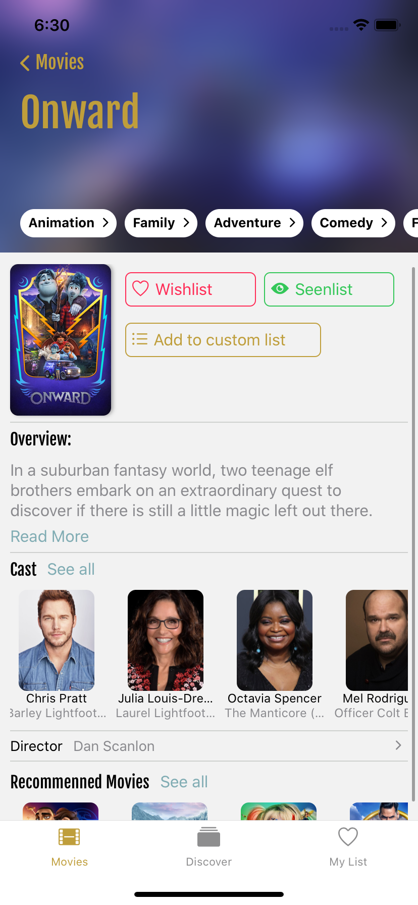
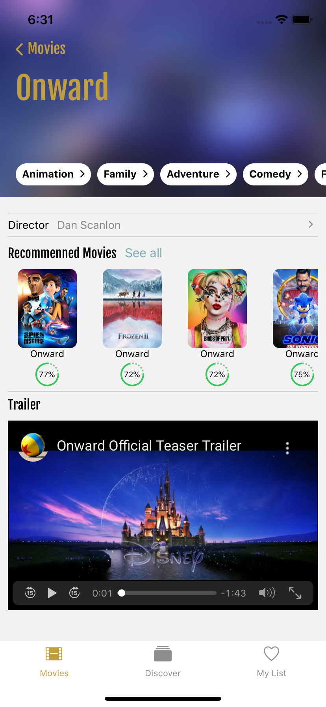

# Movie App

Movie app is an application that uses the [TMDB API](https://www.themoviedb.org/?language=en-US) and is built with React Native.

The app's design is based on [Thomas' app](https://github.com/Dimillian/MovieSwiftUI) which is written in SwiftUI.

|        Home Screen         |        Search Screen         |
| :------------------------: | :--------------------------: |
|  |  |

|        Detail Screen 1         |        Detail Screen 2         |
| :----------------------------: | :----------------------------: |
|  |  |
